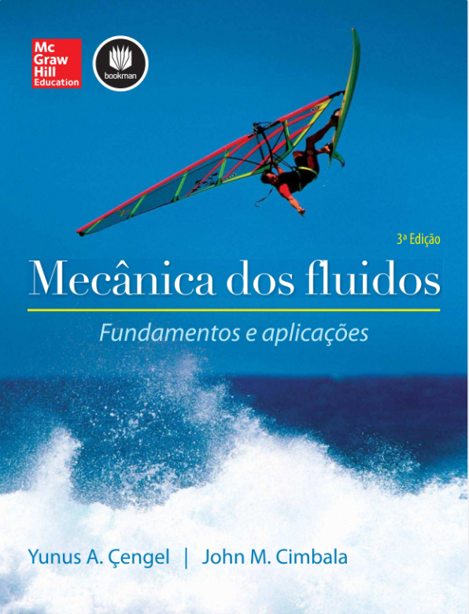
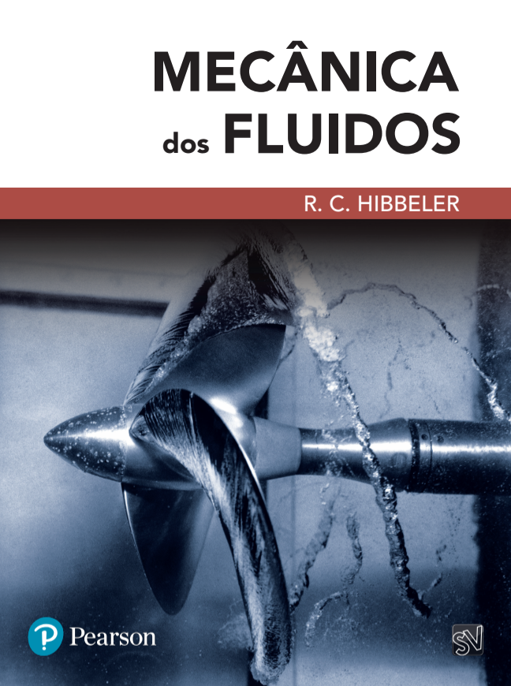
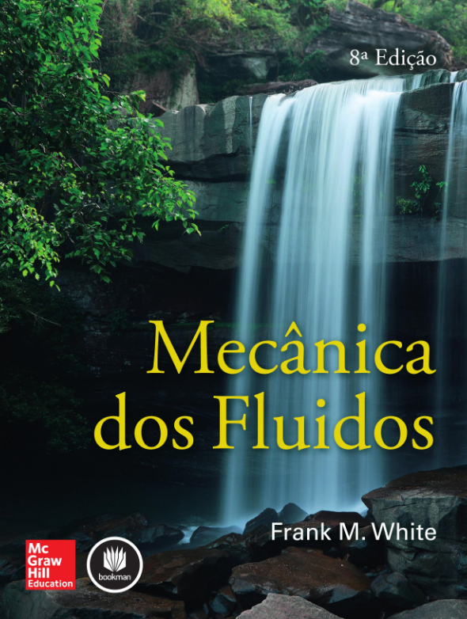

# Mecânica dos Fluidos

Tema|Exemplo|Referência
---|---|---
Estática dos Fluidos||
Cinemática dos Fluidos|[Análise de velocidades e acelerações em um campo bidimensional]()|Exemplo 4-1 de Exemplo 4-1 de CENGEL, Y. A.; CIMBALA, J. M. Mecânica dos fluidos. 3. ed. Porto Alegre: AMGH, Bookman, 2015.
Cinemática dos Fluidos|[Análise de velocidades e acelerações em um campo bidimensional]()|Exercício 3.24 de BRUNETTI, Franco. Mecânica dos fluidos . Pearson Educación, 2008.
Conservação da Massa||
Análise Diferencial do Escoamento||
Escoamento em Condutos Forçados

# Referências Bibliográficas
 
[CENGEL, Y. A.; CIMBALA, J. M. Mecânica dos fluidos. 3. ed. Porto Alegre: AMGH, Bookman, 2015.]() 
[Hibbeler, R. C.. Mecânica dos fluidos. Edição do Kindle.]() 
[WHITE, F. M. Mecânica dos fluidos. 8. ed. Porto Alegre: AMGH, 2018.]() 
 
<>
<>
<>

